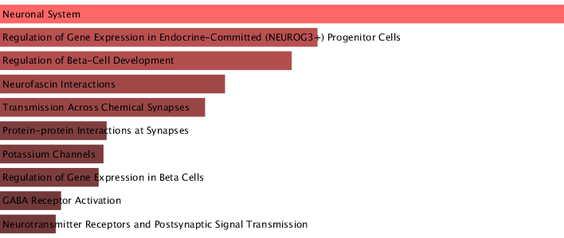

```{r setup, include=FALSE}
knitr::opts_chunk$set(echo = TRUE)
```

```{r load packages}
library(DESeq2)
library(tidyverse)
library(pheatmap)
library(vsn)
library(RColorBrewer)
library(reshape2)
library(ggplot2)
library(patchwork)
library(dplyr)
library(readr)
library(ggrepel)
library(forcats)
library(stringr)

```

### Introduction 

The biological background of the study focuses on Type 1 Diabetes (T1D). T1D is a chronic autoimmune disease characterized by the pancreatic islet inflammation resulting in the specific loss of insulin-secreting β-cells. Tyrosine kinase 2 (TYK2), a member of Janus Kinase family plays a critical role in type-I interferon(IFN-I) mediated cellular signaling is found to be associated with T1D. TYK2 knockout of human iPSCs was used to direct the study the role of the TYK2 in β-cell development and the response to IFNα. The study was perform to elucidate the role of the T1D risk gene TYK2 in β-cell fate and function. Determining the function of TYK2 gene could provide crucial information to validating the JAK inhibitors as a potential new therapeutic strategy to protect β-cell in individuals at risk for T1D or those with early T1D. Ultra-deep bulk RNA-Seq and single-cell RNA-Seq, followed by the differential gene expression analysis and pathway enrichment analysis were used to determine the complete set of the interferon stimulated genes (ISGs) that are regulated by TYK2 in response to IFNα. The gene expression profile was used to reveal the non-potential immune role in the beta-cell development and differentiation. The comparison of the gene expression data from in vitro experiments and pancreatic islets of T1D patients were performed to validate that the finding are clinically relevant to human disease pathogenesis. 


### Methods

DAG of the workflow done in nextflow. 
 
The primary assembly of the reference genome and annotation (GTF) were used to generate an index using STAR v2.7.11b. The index was built using the default STAR parameters. The read pairs were mapped to the human reference genome (GRCh38) with STAR aligner v2.7.11b. The sequencing of raw reads were assessed for quality using FASTQC v0.12.1. FASTQC was run with default parameters on all input FASTQ files. The multi-sample summaries of the FASTQC and the aligning process using STAR were generated with MultiQC v1.31. This process aggregated both the FASTQC reports and STAR alignment logs for quality assessment and further downstream analysis. Exon-level counting was performed using VERSE v1.0.5 with default parameter. VERSE utilizes the aligned reads from STAR and the annotated GTF to calculate the new read counts per gene feature. The individual output files from verse were then consolidated into a single count matrix resulting in the quantified data set. The read count data was analyzed with DESeq2 v1.46.0. The differentially expressed genes were analysed for enrichment for the up-and down-regulated genes using ENRICHR against the Reactome pathways. The counts were normalized, scaled, and analyzed for PCA with default methods.


### Quality Control Evaluation

According to the MultiQC summary, the number of reads all samples ranges from 84.5 million to 118.9 million bases. The mean quality scores of each sequences were of a very good quality calls with the mean quality score ranging around 35 to 36. All 12 samples passed the sequence GC content module with a roughly normal distribution of the GC content, with less than 1% of per base N content module, and with roughly a flat line near 0% on the adapter content. MultiQC has flagged 6 out of the 12 samples with  warning in the per base sequence content, meaning that the difference between A and T, or G and C is greater than 10% in any position in the sequence. Those samples includes control_rep1_R2, control_rep2_R2, control_rep3_R2, exp_rep1_R2, exp_rep2_R2, and exp_rep3_R2. The other 6 samples, control_rep1_R1, control_rep2_R1, control_rep3_R1, exp_rep1_R1, exp_rep2_R1, and exp_rep3_R1, has failed per based sequence content module, indicating that the difference between A and T, or G and C is greater than 20% in any position in the sequence. A warning or a failure could be the results of overrepresented sequences, biased fragmentation, biased composition libraries, and/or due to the fact that the adapter has been aggressively trimmed which introduces a composition biased at the end of the reads. All 12 samples failed the sequence duplication levels of the MultiQC which is natural for RNA-Seq library where few transcripts are highly expressed, otherwise this could be an indication that the adaptor contaminants are present in the reads. In addition, MultiQC also flagged 6 samples with warning on the overrepresented sequences. Those 6 samples are control_rep1_R1, control_rep3_R1, control_rep3_R2, exp_re2_R1, exp_rep2_R2, and exp_rep3_R1. 

High duplication is expected and are often unavoidable in RNA-Seq data especially the ultra-deep RNA-Seq since they measures the expression of the genes and if a few transcript are highly abundant, such as housekeeping genes or rRNA. Those genes will naturally be sequenced hundreds to thousands times leading to the biologically legitimate reads. Since the study performed the library preparation of high-quality RNA using the TruSeq RNA sample, the flagged per base sequence module expected in most non-UMI RNA-Seq protocols as an indication of the random hexamer priming bias at the start of R1 reads. This could be corrected by trimming the first 10 to 15 base pairs from all reads. The overrepresented sequences that were flagged by MultiQC needs to be investigated and removed or filtered if those sequences are adapter dimers or rRNA fragments unless they are highly abundant. If those sequences are highly abundant, they are biologically relevant and do not need to be removed or filtered. Overall, due to the nature of the ultra-deep bulk RNA-Seq, those flagged warning or failed samples by MultiQC modules are expected and it is not a major concern. In most cases, the overrepresented sequences would need to be further investigated and would require some pre-processing steps for the downstream analysis; however, STAR alignment has successfully mapped the reads to the genome and provided an excellent alignment rate of roughly about 95-98%. Those number suggests that those overrepresented sequences were not a major source of the contaminants but rather likely due to the highly abundant and naturally occurring transcript from rRNA or highly expressed mRNAs. The pre-processing is still necessary for the accuracy of the downstream expression analysis regarding removing the first 10-15 base pairs prior to alignment and to remove the positional bias from hexamer priming. Filtering the read mapping to the rRNA loci prior to or during the quantification step to ensure that the normalization is based only on the relevant mRNA population for differential expression.  


### Filtering the counts matrix 
Importing the count data.
```{r}
#count data
counts = as.matrix(read.csv("/projectnb/bf528/students/nobma/projects/project2/project-2-taraobma/full_results/merged_counts/merged_counts.csv", row.names='gene')) #importing the concat csv as a matrix and use gene as the row names
head(counts, 5) #printing the first 5 rows of the cts matrix
#counts #print out the whole cts matrix
```

Filter the count data to keep the genes that are more than or equal to 10 counts in 3 or more samples. 
```{r}
only_counts = counts[, -1] #remove the first column of the counts df
filtered_counts = counts[rowSums(only_counts >= 10) > 3, ] #filter to get the counts of more than or equal to 10 in 3 or more samples
 
#print(filtered_counts)
head(filtered_counts, 5) #print out the first 5 rows of the filtered counts
```

Print out the number of genes before and after the filter was applied. 
```{r}
#print out the number of genes before and after filter
cat("Genes before filtering:", nrow(counts), "\n")
cat("Genes after filtering:", nrow(filtered_counts), "\n")
```

Create plots showing the data distribution of the before and after filtering the data. 
```{r}
#create a df for plotting the before and after filtering the counts
df_before = data.frame(mean_count = rowMeans(counts)) # get the mean count of the df before filtering the count
df_after = data.frame(mean_count = rowMeans(filtered_counts)) #get the mean count of the df after filtering the count

# theme_pub = theme_bw(base_size = 14) + #define the theme for the plot
#   theme(
#     panel.grid = element_blank(),
#     axis.title = element_text(face = "bold"),
#     plot.title = element_text(hjust = 0.5, face = "bold"),
#     axis.text = element_text(color = "black")
#   )

plot_before = ggplot(df_before, aes(x = log10(mean_count + 1))) + #before plot using the defined before df above
  geom_histogram(binwidth = 0.1, fill = "skyblue", color = "black", alpha = 0.7) +
  labs(
    title = "Distribution of Mean Gene Counts (Before Filtering)",
    x = "log10(mean counts per gene + 1)",
    y = "Number of Genes"
  ) +
  theme_minimal(base_size = 13)

plot_after =  ggplot(df_after, aes(x = log10(mean_count + 1))) + #after plot using the defined after plot above
  geom_histogram(binwidth = 0.1, fill = "salmon", color = "black", alpha = 0.7) + 
  labs(
    title = "Distribution of Mean Gene Counts (After Filtering)",
    x = "log10(mean counts per gene + 1)",
    y = "Number of Genes"
  ) +
  theme_minimal(base_size = 13)


#displaying the plots
plot_before
plot_after

#displaying the plots side-by-side
#plot_before + plot_after
```

The genes with low expression across samples that had a count of less than 10 and in less than or equal to 3 samples were removed to reduce the noise. This is to ensure that the uninformative genes are reduced so that the DESeq2 analysis is done on the biologically relevant transcripts. There are 63,241 genes before filtering. Filtering the genes with the stated parameters above omitted 43,683 genes, leaving 19,558 genes to analyze the differential expression. The figure before filtering the count shows a highly skewed distribution towards the low end which are often represents the genes being randomly and weakly transcribed or genes that are irrelevant to the experiment. After filtering, as seen in the figure, the massive peak at the beginning has been removed resulting in a bimodal or roughly normal distribution across the expressed range. 


### Differential Expression Analysis

Cerating a colData for Deseq2 analysis.
```{r}
#creating a col data for deseq2 analysis
colData = data.frame(
  row.names = c("control_rep2", "control_rep1", "exp_rep2", "exp_rep1", "exp_rep3", "control_rep3"),
  timepoint = c("ctrl", "ctrl", "exp", "exp", "exp", "ctrl")
) 
```

Creating a Deseq2 object.
```{r}
# deseq2 object
dds = DESeqDataSetFromMatrix(countData = filtered_counts,
                              colData = colData,
                              design = ~ timepoint)
```

Running the Deseq2 analyis. 
```{r}
dds = DESeq(dds) #run deseq
res = results(dds, contrast=c("timepoint","ctrl","exp")) #result of deseq
res #print out the deseq results
```

Ordering the deseq2 results based on the lowest adjusted p value.
```{r}
#order the results with the lowest padj
resOrdered = res[order(res$padj),] #order the results based on the lowest padj value
deseq2_res = as_tibble(resOrdered, rownames='gene') #create a tibble of the ordered padj value
deseq2_res #show the results of deseq as ranked by the adjusted p value
```

Importing the gtf text file containg the ensenble gene id and its corresponding gene symbol.
```{r}
ids = read_tsv("/projectnb/bf528/students/nobma/projects/project2/project-2-taraobma/full_results/gtf.txt") #importing the gtf.txt and print out the file as tibble
as_tibble(ids) #show the ids tibble
```

Left joining the gtf tibble to the deseq2 results with the common gene ensemble ids and relocate the gene symbol to the very left column of the table. 
```{r}
#left join the tibble imported above based on the gene from deseq2 res and gene_id from ids
deseq2_res = deseq2_res %>% 
  left_join(ids, by= c("gene" = "gene_id")) %>% 
  relocate(gene_name) #relocate the gene name to the very left column

deseq2_res #print out the result 
```

A table showing the top 10 differentially expressed genes and the statistics provided by DESeq2 as ranked by the adjusted p value.
```{r}
#print out a table of top 10 DE genes 
top10_genes = deseq2_res %>% #extract the top10 genes from deseq2_res
  head(10) #top 10 rows

top10_genes #display the table of top 10 DE genes
```

An adjusted p value of 0.05 was chosen to obtain the statistically significant genes. At this threshold, there are 676 significant genes.
```{r}
pos_res = deseq2_res %>% filter(padj < 0.05 & log2FoldChange > 0 ) %>% select(gene_name) #padj value of 0.05 
pos_res
write.table(pos_res, file = "/projectnb/bf528/students/nobma/projects/project2/project-2-taraobma/positive_sig_genes.txt", col.names = F, row.names = F, quote = F) #write out the significant genes at padj 0.05

```
Reactome Pathway obtained from the ENRICHR analysis from enrichr website using the table fo statistically significant genes obtained above. 

Generating the ranked list by log1foldchange for the fgsea analysis
```{r} 
#generate the ranked list by log2fold change for fgsea 
deseq2_res_ordered = deseq2_res %>% 
  drop_na() %>%  #drop all the na values in the df
  distinct(gene_name, .keep_all = TRUE) %>%
  arrange(desc(log2FoldChange)) #arrage the gene list by log2fold change

rnk_list = setNames(deseq2_res_ordered$log2FoldChange, deseq2_res_ordered$gene_name) #order the rank list based on log2foldchange
head(rnk_list, 10)
```

Read in the GMT file to be used for fgsea analysis. 
```{r}
library(fgsea)
#read in the GMT file
pathways = gmtPathways("/projectnb/bf528/students/nobma/projects/project2/project-2-taraobma/c2.all.v2025.1.Hs.symbols.gmt")
head(pathways) #print out the top rows of the gmt dataset

```

Running the FGSEA pathwys. 
```{r}
fgseaRes = fgsea(pathways, rnk_list, minSize=15, maxSize=500) #run the fgsea including gene set that have 15 genes present in the list and at most 500 genes.

head(fgseaRes[order(pval), ]) #sort the result by lowest p value
```

Below is a table showing the top 10 significant pathways from the fgsea results.
```{r}
# Filter for significant pathways
sigPathways <- fgseaRes %>%
  as.data.frame() %>% #read in as a df
  filter(padj < 0.05) #filter the padj value with 0.05 threshold


topPathways <- sigPathways %>%  #top pathways for the padj threshold value
  arrange(padj) #arrange the pathway by the lowest padj value

head(topPathways, 10) #print out the top 10 of the padj value
```
```{r}
#table like visualization of the top enriched pathways with enrichment scores and the ranked gene list. 

# topPathwaysUp = fgseaRes[ES > 0][head(order(pval), n=10), pathway]
# topPathwaysDown = fgseaRes[ES < 0][head(order(pval), n=10), pathway]
# topPathways = c(topPathwaysUp, rev(topPathwaysDown))
# plotGseaTable(pathways[topPathways], rnk_list, fgseaRes, 
#               gseaParam=0.5)
```

Bar plot showing the top most significant enriched pathways. 
```{r}
topPathwaysUp <- fgseaRes %>%  #top pathways
  filter(NES > 0) %>% #get the NES > 0 
  arrange(padj) %>%  #arrange the result based on the lowest padj value
  slice(1:10) #extract the top 10 results

topPathwaysDown <- fgseaRes %>% #down reg pathways
  filter(NES < 0) %>%  #get NES < 0
  arrange(padj) %>%  #arrange based on the padj value
  slice(1:10)

topPathways <- bind_rows(topPathwaysUp, topPathwaysDown) #bing so that the top pathway is on top and downregualted pathway is at the bottom

#wrap text of the pathways
topPathways$pathway <- str_wrap(topPathways$pathway, width = 40)

#direction legend
topPathways <- topPathways %>%
  mutate(Direction = ifelse(NES > 0, "Upregulated", "Downregulated"))

#create a horizontal bar plot
ggplot(topPathways, aes(x = fct_reorder(pathway, NES), y = NES, fill = Direction)) +
  geom_col() +
  coord_flip() +  # horizontal bars
  scale_fill_manual(values = c("Upregulated" = "firebrick", "Downregulated" = "steelblue")) +
  labs(
    x = "",
    y = "Normalized Enrichment Score (NES)",
    title = "Top Reactome Pathways (FGSEA)"
  ) +
  theme_minimal(base_size = 13) +
  theme(
    panel.grid = element_blank(),
    axis.text.y = element_text(size = 10),
    axis.title.y = element_blank(),
    plot.title = element_text(hjust = 0.5, face = "bold")
  )
```

A threshold of 0.05 was chosen for the adjusted p value to determine the significant genes for ENRICHR and fGSEA analysis as per statistical convention. The ENRICHER analysis on the 676 significant genes, the experimental treatment has a significant impact on the neuro-endocrine system and neuronal function. The treatment likely caused an significant change in the gene regulatory network involving in the pancreatic endocrine cell identity and function. The strong link to NEUROG3 and Beta-Cell development is an indication that the cell is undergoing a differentiation process. The associated enrichment of the transmission across chemical synapse, potassium channels, and the GABA receptor activation provides a mechanistic explanation for the effect. This means that the changes in gene expression directly targets the membrane machinery that control how the neurons fires and release the signaling molecules. 

The fGSEA analysis shows that the treatment causes both the upregulation of neuro-developmental and epigenetic programs and downregulation of cell proliferation/stress/apoptosis programs. The links to Beta-cell regulation and the regulation of key inflammatory pathways indicates that the dataset is highly relevant to the Beta-cell destruction or related to autoimmune disorder. 

Both the ENIRCHR and fGSEA results, shows the results that focuses on the neuro-endocrine system. Top terms in both analyses points to the regulation of Beta-cell development and pathways that is controlled by the endocrine transcription factor NEUROG3. The fGSEA resutls provides a directional effect of the gene regulation. The cell proliferation and stress pathways, P53 and E2F are downregulated suggesting that the cell is in the state of exiting the proliferative cell cycle, entering the differentiation and inhibiting stress-induced apoptosis which is crucial for insulin-producing cells. The fGSEA analysis provides information on the epigenetic mechanism that relates to the Polycomb Repressive Complex2 (PRC2) and histone modification (H3K27ME3) suggesting the changes in the neuro-endrocrine function observed is driven at the level of chromatin and gene silencing/activation.  


### RNA-seq Quality Control
Normalization of the Deseq2 results for the PCA plot. 
```{r}
#nromalization for PCA
#regularized the log transformation to ensure the all genes contribute equally to the measure of sample similarity - highly expressed doesn't dominate the dist calc between samples
vsd = vst(dds, blind=FALSE) #varaince stabilizing transformation 
rld = rlog(dds, blind=FALSE) #regualrized log transformation 
head(assay(vsd), 3) #print out the matrix of vsd

```

```{r}
# this gives log2(n + 1)
#ntd = normTransform(dds) #transform matrix of normalized counts
#meanSdPlot(assay(ntd)) #plot to visualized the relationship between the mean and sd of the transformed expression value
```

PCA plot showing the cluster of each sample in their corresponding group. 
```{r} 
plotPCA(vsd, intgroup = "timepoint")
```
Plot of the sample-to-sample distances for the experiment to reveal how each samples relates to one another.
```{r}

#graphic of the sample-to-sample distances for the experiment

sampleDists = dist(t(assay(vsd)))

sampleDistMatrix = as.matrix(sampleDists)

rownames(sampleDistMatrix) = paste(vsd$timepoint)
colnames(sampleDistMatrix) = paste(vsd$timepoint)

colors = colorRampPalette( rev(brewer.pal(9, "Blues")) )(255)

pheatmap(sampleDistMatrix,
         clustering_distance_rows=sampleDists,
         clustering_distance_cols=sampleDists,
         col=colors, 
         main = "Sample-to-Sample Distances"
         )
```

The  PCA plot shows a strong separation between the control and experimental groups. The control samples cluster together on the left side which is primarily driven by PC1. This suggests low variation within the control group. The experimental samples are group on the right side, being separated by PC1 with one sample being farther than the two. This indicates that there is an outlier and slightly higher variation within the experimental group. The separation of the control and experimental samples demonstrates the success of the experimental treatment having a major effect on the measured data. 

The heatmap of the sample-to-sample distances shows the clean separation of the two major clusters by the hierarchical clustering of the three experimental samples and the three control samples. The distance values between any experimental and control sample are generally large validating that the two groups are distinct from each other. The distance value within the group are generally small with an exception of one pair belonging in the experimental group. This slight internal heterogeneity aligns with the spread seen in the PCA plot. The clean separation and the small intra-group distances confirms the PCA findings that the two group are fundamentally different and the replicates within the group are highly similar with only one internal variation in the experimental group. In summary, the PCA and the heatmap of the sample-to-sample distances suggests the analysis is based on the reproducible replicates and has successfully captured the major and distinguishing biological effect of the subject of interest.


### Replicate figure 3C and 3F from the main research article 

Determing the number of genes that are up- and downregulated. 
```{r}
#finding how many sig genes are up and downregulated

res_df = as.data.frame(deseq2_res) #read the deseq results as dataframe

sig_res = res_df %>%
  filter(!is.na(padj) & padj < 0.05) #
upregulated = sum(sig_res$log2FoldChange > 0)
downregulated = sum(sig_res$log2FoldChange < 0)

cat("Significant upregulated genes:", upregulated, "\n")
cat("Significant downregulated genes:", downregulated, "\n")
#cat("Total significant genes:", nrow(sig_res), "\n")

```

Preparing the data to be used in the volcano plot.
```{r}
res_vol = deseq2_res
res_vol$significance = "Not Sig"
res_vol$significance[res_vol$padj < 0.05 & res_vol$log2FoldChange > 1] = "Upregulated"
res_vol$significance[res_vol$padj < 0.05 & res_vol$log2FoldChange < -1] = "Downregulated"
```

Top 5 up- and downregulated for marking in the volcano plot. 
```{r}
# top 5 upregulated genes
top_up = res_vol %>%
  filter(significance == "Upregulated") %>%
  arrange(padj) %>%
  head(5)

# top 5 downregulated genes
top_down = res_vol %>%
  filter(significance == "Downregulated") %>%
  arrange(padj) %>%
  head(5)

# print the top 5 of up- and downregulated genes with the log2foldchange and padj 
cat("Top 5 Upregulated Genes:\n")
print(top_up[, c("gene_name", "log2FoldChange", "padj")])

cat("\nTop 5 Downregulated Genes:\n")
print(top_down[, c("gene_name", "log2FoldChange", "padj")])
```

Volcano plot of with the top 5 up- and downregulated genes labelled. 
```{r}
#top 10 key genes
#key_genes = c("RPS4Y1", "PNPO", "YPEL3-DT", "LINC02506", "ENSG00000286339", "ENSG00000289456", "RPS3AP6", "PCDHGB7", "GPRC5D-AS1", "NECTIN3-AS1", 
               #"ENSG00000289575", "PCDHGA10", "SLC2A14", "ENSG00000282914", "SVIL-AS1", "IRAG2", "ZNF717", "NF571-AS1", "KRAS", "NKX2-5")

key_genes = c("RPS4Y1", "PNPO", "YPEL3-DT", "LINC02506", "ENSG00000286339",
               "ENSG00000289575", "PCDHGA10", "SLC2A14", "ENSG00000282914", "SVIL-AS1")

# Add label column for selected genes
res_vol$key_label = ifelse(res_vol$gene_name %in% key_genes, res_vol$gene_name, NA)

ggplot(res_vol, aes(x = log2FoldChange, y = -log10(padj), color = significance)) +
  geom_point(alpha = 0.6, size = 1.5) +
  scale_color_manual(values = c("Downregulated" = "steelblue", 
                                "Not Significant" = "grey80", 
                                "Upregulated" = "firebrick")) +
   annotate("text", x = 3.5, y = 10, label = "UP", color = "firebrick", size = 5) +
  annotate("text", x = -3.5, y = 10, label = "DOWN", color = "steelblue", size = 5) +
  geom_vline(xintercept = c(-1, 1), linetype = "dashed", color = "black") +
  #geom_hline(yintercept = -log10(0.05), linetype = "dashed", color = "black") +
  labs(
    x = "Expression difference (log₂FC)",
    y = "Significance (−log₁₀ Adjusted p-value)"
  ) +
  geom_text_repel(
  data = res_vol %>% filter(!is.na(key_label)),
  aes(label = key_label, y = max(-log10(padj), na.rm = TRUE) * 0.95),
  size = 3,
  max.overlaps = Inf,
  direction = "x",       # spread horizontally
  hjust = 0.5
  ) +
  coord_cartesian(xlim = c(-5, 5), ylim = c(0, 15)) +
  theme_classic(base_size = 14) +
  theme(legend.position = "none")
```
Using the FGSEA result to replicate figure 3F from the article. 
```{r}
#calculate % of DE genes in each category

top10_names = topPathways %>%
  arrange(padj) %>%      #change to arrange(desc(percent)) for largest DE% pathways
  slice_head(n = 10) %>%
  pull(pathway)          #get pathway names for subsetting

#calculate percent DE genes only for these top 10
top10_fgsea = topPathways %>%
  filter(pathway %in% top10_names) %>%
  rowwise() %>%
  mutate(
    n_DE = length(leadingEdge),  #number of DE genes in leading edge
    n_total = length(pathways[[pathway]]),  #total genes in pathway
    percent = 100 * n_DE / n_total,
    direction = ifelse(NES > 0, "Upregulated", "Downregulated")
  ) %>%
  ungroup() %>%
  mutate(direction = factor(direction, levels = c("Upregulated", "Downregulated")))

ggplot(top10_fgsea, aes(x = percent, y = fct_reorder(pathway, percent), fill = padj)) +
  geom_col(width = 0.5) +
  facet_grid(direction ~ ., scales = "free_y", space = "free_y") +
  scale_fill_gradientn(colors = c("red", "magenta", "blue"), name = "Adjusted\np value") +
  labs(
    x = "Percentage of DE genes in category (%)",
    y = "",
    title = "(FGSEA) Reactome Enrichment Pathways"
  ) +
  theme_minimal(base_size = 13) +
  theme(
    panel.grid = element_blank(),
    axis.title.y = element_blank(),
    strip.text = element_text(face = "bold", size = 12),
    legend.position = "right"
  )
```

There are 319 upregulated genes and 412 downregulated genes reported in the research article. I observed 676 upregulated genes and 562 downregulated genes. This could be due to the use of different quantification program and the parameters used when filtering the data. The methods used in the research article was much stricter by setting the FDR threshold of less than 0.01 for the differentially expressed genes for enrichment. In addition, the data could also be different, different versions of the gtf file and different version of the human genome was used to for the alignment. 

The paper main focus of the RNA-seq results is on Beta-cell response to Interferon-alpha regarding the regulation of the Beta-cell immune responses and vulnerability. TYK2 is a crucial modulator in the inflammatory response in Beta-cells triggered by IFN-alpha. The inhibition of TYK2 prevented the IFN-alpha-induced stress/antigen presentation, enhancing the Beta-cell survival thus a potential therapeutic target in halting the progression of T1D. Such that, the genes marked on the research article volcano plot are the gene is interest with relation to the cell proliferation and cell death while the volcano plot generated in this report focuses on the top 5 differentially expressed genes being labelled with no specific selected genes of interest. If we were to labelled the volcano plot with the article's genes of interest, the resulted volcano plot should look similar to th

ENRICHR analysis provides the pathways associated with the regulation of Beta-cell development and NEUROG3 pathways and the functional system of the neuronal system and the potassium channels. My FGSEA predominantly features the epigenetic pathways (H3K2ME3, and PRC2) suggesting the experimental samples has a strong developmental signal highlighting the global Beta-cell fate in differentiation and survival. Comparing the results of that of a research article, this downstream analysis reveals the the broader effect of the Beta-cells developmental and differentiation program rather than the immediate immunological components that contributes to the Beta-cell destruction in T1D from the acute IFN-alpha responses. The research article GSEA results highlights the TYK2-mediated inflammation/antigen presentation response. Overall, both moethods yields pathways related to the Beta-cell development, neuronal signaling, and P53/E2F control validate the core biological system identified by the original authors. The differences simply reflect on the filtering details of the data and the genes of interest.  


```{r}
sessioninfo::session_info()
```


