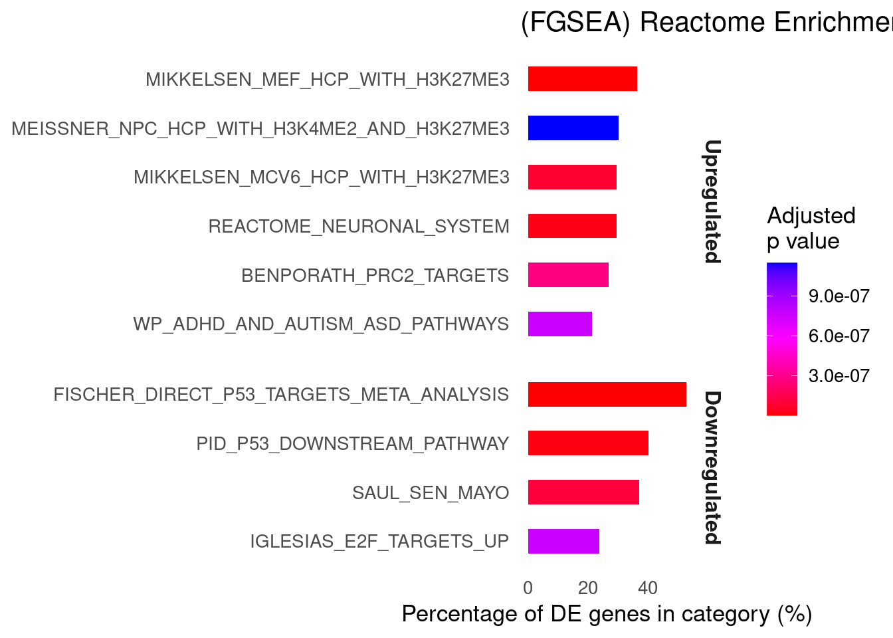

# RNA-seq Analysis of TYK2-Mediated β-Cell Response
This project implements a reproducible RNA-seq workflow to investigate the role of TYK2 in β-cell response to IFN-α, a key mechanism implicated in Type 1 Diabetes (T1D).

### The analysis integrates:
- Alignment (STAR)
- Quantification (VERSE)
- Differential expression (DESeq2)
- Pathway enrichment (Enrichr, FGSEA)
- Quality control (FASTQC, MultiQC)
- Exploratory data analysis (PCA, clustering)

## Biological Question
TYK2 is a critical mediator of interferon signaling in pancreatic β-cells.  
This project evaluates how TYK2 perturbation alters:
- Gene expression programs
- Immune response pathways
- β-cell differentiation and survival mechanisms

## Workflow Overview

FASTQC → STAR Alignment → VERSE Quantification → DESeq2 → Enrichment Analysis.  
The pipeline was implemented in Nextflow and executed on HPC.

## Quality Control Summary
- 12 samples (3 control, 3 experimental; paired-end)
- 84–119M reads per sample
- Mean quality score: ~35–36
- Alignment rate: 95–98%

Observed RNA-seq–specific patterns:
- High duplication (expected for ultra-deep RNA-seq)
- Random hexamer priming bias (R1 reads)
- Minimal adapter contamination 

Overall QC indicates high-quality sequencing suitable for downstream analysis.

## Gene Filtering
- Initial genes: 63,241
- After filtering (≥10 counts in ≥3 samples): 19,558 genes   

Filtering removed low-expression noise and improved statistical power.

## Differential Expression Results
Using DESeq2 (FDR < 0.05):
- 676 upregulated genes
- 562 downregulated genes

### Volcano Plot

Strong separation between control and experimental conditions indicates a robust transcriptional response.

## Sample Clustering & PCA
### PCA
Clear separation between control and experimental groups along PC1.
### Sample Distance Heatmap
Replicates cluster tightly within condition, confirming reproducibility.

## Pathway Enrichment Analysis
### Enrichr (Reactome)
Significant enrichment in:
- β-cell development pathways
- NEUROG3 regulation
- Neuroendocrine signaling
- Ion channel and synaptic pathways

## FGSEA (Reactome Gene Sets)
Key observations:
- Upregulation of neurodevelopmental and epigenetic programs
- Downregulation of cell proliferation (P53, E2F)
- Enrichment of PRC2 / H3K27me3-associated chromatin regulation

## Biological Interpretation
The treatment induces:
- Activation of β-cell differentiation programs
- Suppression of proliferative and stress pathways
- Epigenetic remodeling linked to endocrine lineage specification

These findings align with published evidence that TYK2 modulates IFN-α–mediated β-cell immune vulnerability and may serve as a therapeutic target in T1D.

## Tools Used
- STAR
- VERSE
- FASTQC
- MultiQC
- DESeq2
- Enrichr
- FGSEA
- R (tidyverse, ggplot2, pheatmap)
- Nextflow

## Key Skills Demonstrated
- RNA-seq QC and alignment
- Count matrix filtering strategy
- Differential expression modeling
- Pathway enrichment interpretation
- PCA & clustering validation
- Biological interpretation of transcriptional programs
- Reproducible workflow development
