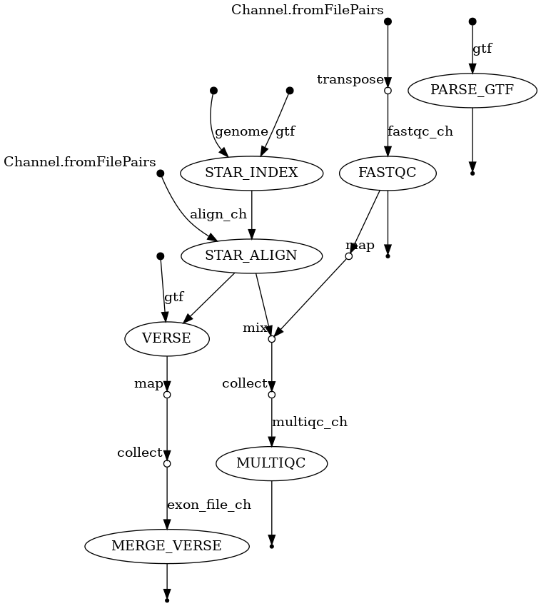
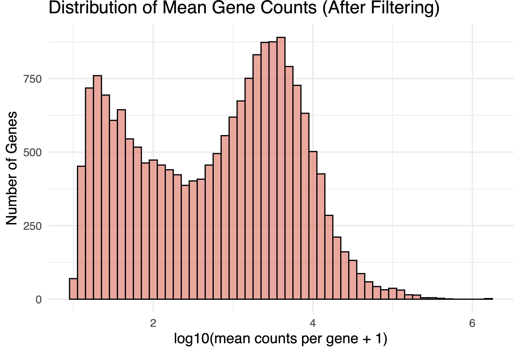
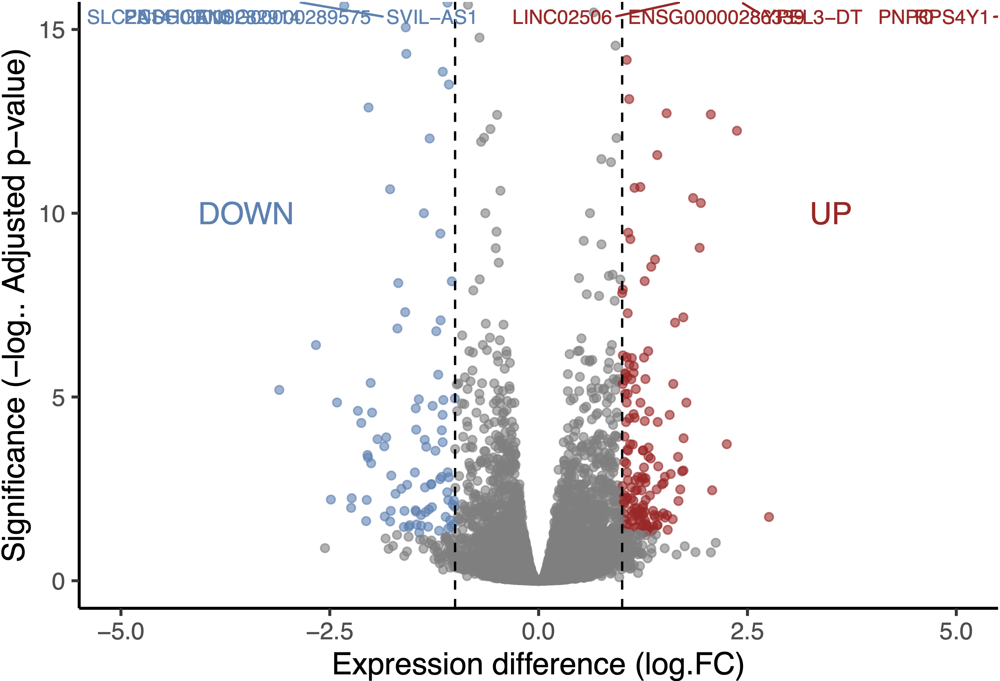
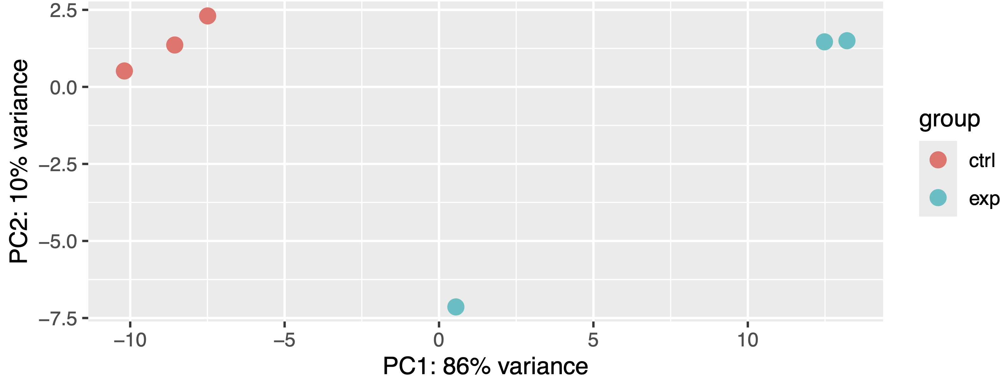
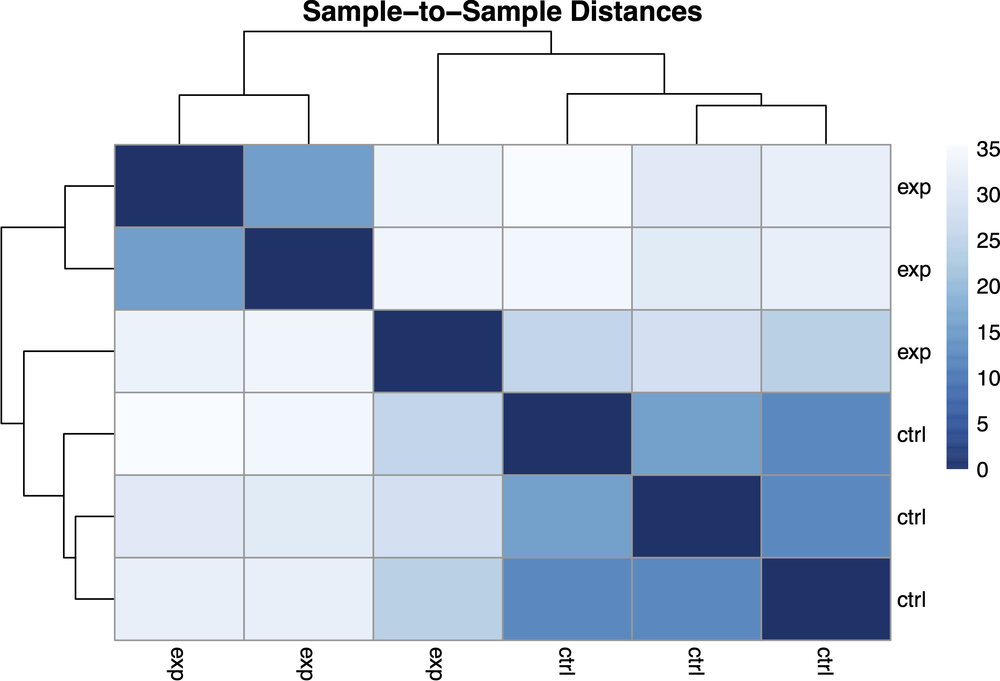
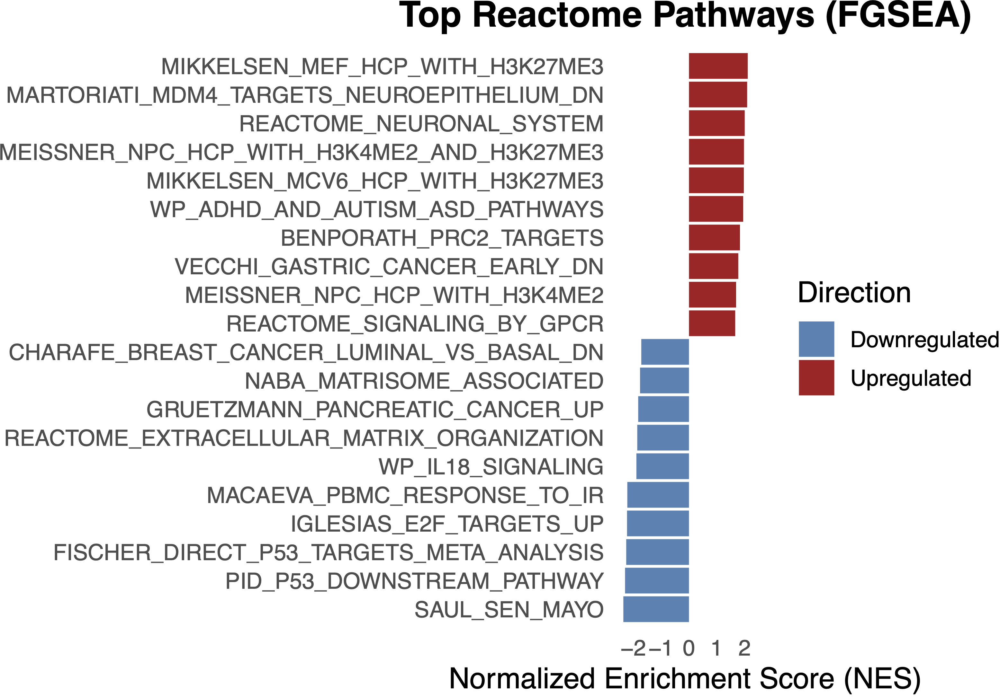

# RNA-seq Analysis of TYK2-Mediated β-Cell Response

## Overview
Implemented a modular Nextflow DSL2 RNA-seq pipeline to investigate the role of TYK2 in 
β-cell response to IFN-α, a key mechanism implicated in Type 1 Diabetes (T1D).

The workflow performs read QC, alignment, quantification, differential expression analysis, 
and pathway enrichment analysis.

## Biological Question
TYK2 is a critical mediator of interferon signaling in pancreatic β-cells.
This project evaluates how TYK2 perturbation alters:
- Gene expression programs
- Immune response pathways
- β-cell differentiation and survival mechanisms

## Dataset
- Organism: *Homo sapiens* (GRCh38)
- Cell model: TYK2 knockout human iPSC-derived SC-islets (stem cell-islets)
- Condition: TYK2 KO vs. wildtype, treated with IFN-α
- Sequencing: Ultra-deep bulk RNA-seq, paired-end (Illumina)
- Samples: 6 total (3 experimental, 3 control)
- Reference genome: GRCh38 + Ensembl GTF


## Workflow


PARSE_GTF → FASTQC → STAR_INDEX → STAR_ALIGN → VERSE → MERGE_VERSE  
(MULTIQC aggregates QC reports in parallel)

Implemented using modular Nextflow processes with Singularity containers.

## Usage

**1. Clone the repository**
```
git clone https://github.com/taraobma/project2-RNA-seq.git
cd project2-RNA-seq
```

**2. Run the pipeline**
```
nextflow run main.nf -profile singularity,cluster
```
**Requirements:** Nextflow ≥ 22.0, Singularity

> **Note:** Developed and tested on BU SCC HPC cluster using Singularity containers.

## Quality Control
- 12 samples total (6 control R1/R2, 6 experimental R1/R2); paired-end ultra-deep RNA-seq
- Read counts per sample: 84.5M – 118.9M reads
- Mean quality score: 35–36 across all samples
- Alignment rate: 95–98% (STAR v2.7.11b to GRCh38)
- All samples passed GC content, adapter content, and per-base N content modules
- R1 reads flagged for per-base sequence content — expected random hexamer priming bias
- R2 reads flagged with warnings (A/T or G/C difference >10%) — consistent with non-UMI RNA-seq
- High duplication expected and acceptable for ultra-deep RNA-seq
- 6 samples flagged for overrepresented sequences — assessed as likely rRNA or highly expressed mRNA, not contaminants

## Key Results
> 676 upregulated | 562 downregulated | FDR < 0.05 | Alignment: 95–98% | 19,558 genes after filtering

## Gene Filtering
- Initial genes: 63,241
- Filter: ≥10 counts in >3 samples
- Genes after filtering: 19,558 (removed 43,683 low-expression genes)

Filtering removed the heavily right-skewed low-expression peak, resulting in a bimodal 
distribution of well-expressed genes suitable for differential expression analysis.



## Differential Expression Results
Using DESeq2 v1.46.0 (FDR < 0.05, |log2FC| > 1):
- **676 upregulated** genes
- **562 downregulated** genes

**Top 5 upregulated:** RPS4Y1, PNPO, YPEL3-DT, LINC02506, ENSG00000286339  
**Top 5 downregulated:** ENSG00000289575, PCDHGA10, SLC2A14, ENSG00000282914, SVIL-AS1



## Sample Clustering & PCA

### PCA
PC1 explains 86% of variance and cleanly separates control and experimental groups. 
Control samples cluster tightly; one experimental replicate shows slightly higher 
variance along PC2, visible as an outlier within the group.



### Sample Distance Heatmap
Hierarchical clustering cleanly separates the two groups. Intra-group distances are 
small with one exception in the experimental group, consistent with the PCA outlier.



## Pathway Enrichment Analysis

### Enrichr (Reactome Pathways 2024)
Significant enrichment in:
- β-cell development and NEUROG3 regulation
- Neuroendocrine and neuronal signaling
- Potassium channels and GABA receptor activation
- Transmission across chemical synapses


### FGSEA (MSigDB C2, c2.all.v2025.1.Hs.symbols.gmt)
- Upregulated: H3K27me3/PRC2 epigenetic remodeling, neuronal system (NES: 2.11–2.00), β-cell differentiation programs
- Downregulated: P53 pathway (NES: −2.31), E2F targets (NES: −2.24), IL18 signaling, extracellular matrix organization



## Biological Interpretation
- Loss of TYK2 regulates KRAS expression, compromising endocrine precursor 
  emergence during β-cell development
- TYK2 inhibition prevented IFN-α–induced MHC Class I and II upregulation, 
  enhancing β-cell survival against CD8+ T-cell cytotoxicity
- Transcriptional findings support TYK2 inhibition as a therapeutic strategy 
  to halt T1D progression


## Technical Highlights
- Ultra-deep bulk RNA-seq analysis (84–119M reads/sample)
- Modular Nextflow DSL2 pipeline with Singularity containers
- Genome-guided alignment to GRCh38 with STAR
- Comparative pathway analysis (Enrichr + FGSEA)
- Variance-stabilized PCA and sample clustering
- Fully reproducible workflow on HPC

## Repository Structure
```
├── main.nf                        # Main Nextflow pipeline
├── nextflow.config                # Configuration file
├── colData.csv                    # Sample metadata (6 samples: 3 exp, 3 ctrl)
├── c2.all.v2025.1.Hs.symbols.gmt  # MSigDB C2 gene sets (FGSEA input)
├── positive_sig_genes.txt         # Significant gene list
├── modules/                       # Modular process definitions
│   ├── fastqc/main.nf
│   ├── star_index/main.nf
│   ├── star_align/main.nf
│   ├── verse/main.nf
│   ├── merge_verse/main.nf
│   ├── multiqc/main.nf
│   └── parse_gtf/main.nf
├── envs/                          # Base Conda environment
├── figures/                       # Plots and visualizations
    ├── figures-latex              # Plots and visualizations in pdf format
    └── figures-png                # Plots and visualizations in png format
├── full_results/                  # Pipeline outputs
└── .gitignore
```

## Tools Used
- STAR v2.7.11b
- VERSE v1.0.5
- FastQC v0.12.1
- MultiQC v1.31
- DESeq2 v1.46.0
- Enrichr (Reactome Pathways 2024)
- FGSEA (MSigDB C2 v2025.1)
- R (tidyverse, ggplot2, pheatmap, ggrepel, fgsea, patchwork)
- Nextflow
- Singularity

